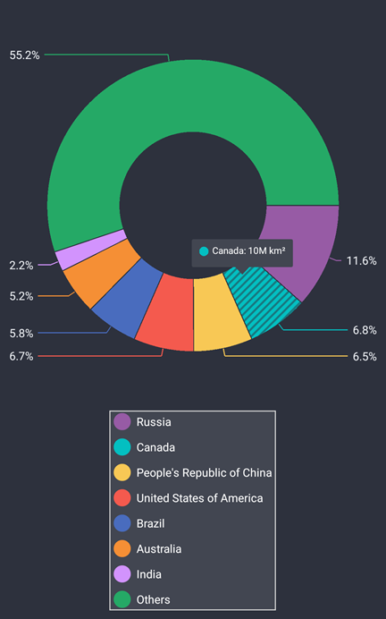

<!-- default badges list -->

[](https://supportcenter.devexpress.com/ticket/details/T1019971)
[](https://docs.devexpress.com/GeneralInformation/403183)
<!-- default badges end -->
<!-- default file list -->
*Files to look at*:

* [Startup.cs](./CS/PieChartGetStarted/Startup.cs)
* [MainPage.xaml](./CS/PieChartGetStarted/MainPage.xaml)
* [ViewModel.cs](./CS/PieChartGetStarted/ViewModel.cs)
<!-- default file list end -->

# DevExpress Pie Chart for .NET MAUI

The [PieChartView](https://docs.devexpress.com/MAUI/DevExpress.Maui.Charts.PieChartView) component visualizes data as a circle chart divided into slices to illustrate numerical proportion.


## Prerequisites

1. Install Visual Studio 2022 and the latest .NET MAUI version. See the following topic on docs.microsoft.com for more information: [.NET MAUI Installation](https://docs.microsoft.com/en-gb/dotnet/maui/get-started/installation).
1. Register the following NuGet feed in Visual Studio: **https://nuget.devexpress.com/free/api**.
    > If you are an active [DevExpress Universal](https://www.devexpress.com/subscriptions/universal.xml) customer, DevExpress Controls for .NET MAUI are available in your [personal NuGet feed](https://nuget.devexpress.com).

## What's in This Repository

This example allows you to get started with the [PieChartView](https://docs.devexpress.com/MAUI/DevExpress.Maui.Charts.PieChartView) component and explore its basic functionality.



## How to Create This Application

The step-by-step instructions below describe how to create an application similar to the application in this repository.

### Create a New Project

1. In Visual Studio 2022, create a new .NET MAUI project. Name it *PieChartGetStarted*.
    > If the wizard does not propose a template for .NET MAUI projects, you can call the following command in a CLI to create a new .NET MAUI project:
    > ```
    > dotnet new maui -n PieChartGetStarted
    > ```
1. Install the **DevExpress.Maui.Charts** package from this feed.

> DevExpress Pie Chart for .NET MAUI supports iOS and Android. The project should only contain these platforms.

### Add a Pie Chart to the Main Page

In the *MauiProgram.cs* file, register a handler for the DevExpress PieChartView:

```cs
using Microsoft.Maui;
using Microsoft.Maui.Hosting;
using Microsoft.Maui.Controls.Hosting;
using DevExpress.Maui.Charts;
using PieChartGetStarted;

namespace PieChartGetStarted {
    public static class MauiProgram {
        public static MauiApp CreateMauiApp() {
            var builder = MauiApp.CreateBuilder();
            builder
                .UseMauiApp<App>()
                .ConfigureMauiHandlers((handlers) => {
                    handlers.AddHandler<PieChartView, PieChartViewHandler>();
                })
                .ConfigureFonts(fonts => {
                    fonts.AddFont("OpenSans-Regular.ttf", "OpenSansRegular");
                });
            return builder.Build();
        }
    }
}
```

In the *MainPage.xaml* file, use the *dxc* prefix to declare the **DevExpress.Maui.Charts** namespace and add a [PieChartView](https://docs.devexpress.com/MAUI/DevExpress.Maui.Charts.PieChartView) instance to the **ContentPage**:
```xaml
<ContentPage xmlns="http://schemas.microsoft.com/dotnet/2021/maui"
             xmlns:x="http://schemas.microsoft.com/winfx/2009/xaml"
             x:Class="PieChartGetStarted.MainPage"
             xmlns:dxc="clr-namespace:DevExpress.Maui.Charts;assembly=DevExpress.Maui.Charts">
        <dxc:PieChartView>
        </dxc:PieChartView>
</ContentPage>
```

### Populate the Pie Chart with Data
In this example, the pie chart compares countries by area. Create a *ViewModel.cs* file with the following classes: 

```cs
using System.Collections.Generic;
using Microsoft.Maui.Graphics;

class ViewModel {
    public IReadOnlyList<LandAreaItem> LandAreas { get; }

    public ViewModel() {
        LandAreas = new List<LandAreaItem>() {
            new LandAreaItem("Russia", 17.098),
            new LandAreaItem("Canada", 9.985),
            new LandAreaItem("People's Republic of China", 9.597),
            new LandAreaItem("United States of America", 9.834),
            new LandAreaItem("Brazil", 8.516),
            new LandAreaItem("Australia", 7.692),
            new LandAreaItem("India", 3.287),
            new LandAreaItem("Others", 81.2)
        };
    }
}

class LandAreaItem {
    public string CountryName { get; }
    public double Area { get; }

    public LandAreaItem(string countryName, double area) {
        this.CountryName = countryName;
        this.Area = area;
    }
}
```

In the *MainPage.xaml* file, add a new [DonutSeries](https://docs.devexpress.com/MAUI/DevExpress.Maui.Charts.DonutSeries) object to the [PieChartView.Series](https://docs.devexpress.com/MAUI/DevExpress.Maui.Charts.PieChartView.Series) collection. To bind the series to data, set the [DonutSeries.Data](https://docs.devexpress.com/MAUI/DevExpress.Maui.Charts.PieSeries.Data) property to a [PieSeriesDataAdapter](https://docs.devexpress.com/MAUI/DevExpress.Maui.Charts.PieSeriesDataAdapter) object. Use the adapter’s properties to specify the data source and its fields that contain values and labels for series points:

```xaml
<ContentPage xmlns="http://schemas.microsoft.com/dotnet/2021/maui"
             xmlns:x="http://schemas.microsoft.com/winfx/2009/xaml"
             x:Class="PieChartGetStarted.MainPage"
             xmlns:local="clr-namespace:PieChartGetStarted"
             xmlns:dxc="clr-namespace:DevExpress.Maui.Charts;assembly=DevExpress.Maui.Charts">
    <ContentPage.BindingContext>
        <local:ViewModel/>
    </ContentPage.BindingContext>
    <dxc:PieChartView>
        <dxc:PieChartView.Series>
            <dxc:DonutSeries>
                <dxc:DonutSeries.Data>
                    <dxc:PieSeriesDataAdapter DataSource="{Binding LandAreas}"
                                              LabelDataMember="CountryName"
                                              ValueDataMember="Area"/>
                </dxc:DonutSeries.Data>
            </dxc:DonutSeries>
        </dxc:PieChartView.Series>
    </dxc:PieChartView>
</ContentPage>
```

### Add a Legend to the Pie Chart
Create a [Legend](https://docs.devexpress.com/MAUI/DevExpress.Maui.Charts.Legend) object, change its settings, and assign it to the [PieChartView.Legend](https://docs.devexpress.com/MAUI/DevExpress.Maui.Charts.ChartBaseView.Legend) property:

```xaml
<dxc:PieChartView>
    <!--...-->
    <dxc:PieChartView.Legend>
        <dxc:Legend Orientation="TopToBottom"
                    HorizontalPosition="Center"
                    VerticalPosition="BottomOutside"/>
    </dxc:PieChartView.Legend>
</dxc:PieChartView>
```

### Enable Series Labels
Set the [DonutSeries.Label](https://docs.devexpress.com/MAUI/DevExpress.Maui.Charts.PieSeries.Label) property to a [PieSeriesLabel](https://docs.devexpress.com/MAUI/DevExpress.Maui.Charts.PieSeriesLabel) object with the specified [TextPattern](https://docs.devexpress.com/MAUI/DevExpress.Maui.Charts.SeriesLabel.TextPattern), [Position](https://docs.devexpress.com/MAUI/DevExpress.Maui.Charts.PieSeriesLabel.Position), and [Indent](https://docs.devexpress.com/MAUI/DevExpress.Maui.Charts.SeriesLabel.Indent) settings:
```xaml
<dxc:PieChartView>
    <dxc:PieChartView.Series>
        <dxc:DonutSeries>
            <!--...-->
            <dxc:DonutSeries.Label>
                <dxc:PieSeriesLabel TextPattern="{}{VP}%" Position="TwoColumns" Indent="20"/>
            </dxc:DonutSeries.Label>
        </dxc:DonutSeries>
    </dxc:PieChartView.Series>
</dxc:PieChartView>
```

### Enable Tooltips for Chart Segments
To show hints, set the [PieChartView.Hint](https://docs.devexpress.com/MAUI/DevExpress.Maui.Charts.PieChartView.Hint) property to a [PieHint](https://docs.devexpress.com/MAUI/DevExpress.Maui.Charts.PieHint) object with its [Enabled](https://docs.devexpress.com/MAUI/DevExpress.Maui.Charts.HintBase.Enabled) property set to **True**:

```xaml
<dxc:PieChartView>
    <dxc:PieChartView.Hint>
        <dxc:PieHint Enabled="True"/>
    </dxc:PieChartView.Hint>
    <!--...-->
</dxc:PieChartView>
```

Specify the text pattern for tooltips of donut segments:
```xaml
<dxc:PieChartView>
    <!--...-->
    <dxc:PieChartView.Series>
        <dxc:DonutSeries>
            <!--...-->
            <dxc:DonutSeries.HintOptions>
                <dxc:PieSeriesHintOptions PointTextPattern="{}{L}: {V}M sq km"/>
            </dxc:DonutSeries.HintOptions>
        </dxc:DonutSeries>
    </dxc:PieChartView.Series>
</dxc:PieChartView>
```

### Modify the Pie Chart Appearance

In the view model, define a palette of custom colors for donut segments:
```cs
using Microsoft.Maui.Graphics;
// ...
class ViewModel {
    // ...
    readonly Color[] palette;
    public Color[] Palette => palette;

    public ViewModel() {
        // ...
        palette = PaletteLoader.LoadPalette("#975ba5", "#03bfc1", "#f8c855", "#f45a4e",
                                            "#496cbe", "#f58f35", "#d293fd", "#25a966");}
}

static class PaletteLoader {
    public static Color[] LoadPalette(params string[] values) {
        Color[] colors = new Color[values.Length];
        for (int i = 0; i < values.Length; i++)
            colors[i] = Color.FromArgb(values[i]);
        return colors;
    }
}
```

Set the [PieChartView.ChartStyle](https://docs.devexpress.com/MAUI/DevExpress.Maui.Charts.PieChartView.ChartStyle) property to a [PieChartStyle](https://docs.devexpress.com/MAUI/DevExpress.Maui.Charts.PieChartStyle) object with the specified [Palette](https://docs.devexpress.com/MAUI/DevExpress.Maui.Charts.ChartStyleBase.Palette) and [BackgroundColor](https://docs.devexpress.com/MAUI/DevExpress.Maui.Charts.ChartStyleBase.BackgroundColor) properties to change the chart's color scheme:
```xaml
<ContentPage>
    <ContentPage.BindingContext>
        <local:ViewModel/>
    </ContentPage.BindingContext>
    <dxc:PieChartView>
        <!--...-->
        <dxc:PieChartView.ChartStyle>
            <dxc:PieChartStyle Palette="{Binding Palette}" 
                               BackgroundColor="#2d313d"/>
        </dxc:PieChartView.ChartStyle>
    </dxc:PieChartView>
</ContentPage>
```

Use the [PieChartView.SelectionBehavior](https://docs.devexpress.com/MAUI/DevExpress.Maui.Charts.PieChartView.SelectionBehavior) property to specify how to highlight a donut segment when a user selects it:
```xaml
<dxc:PieChartView SelectionBehavior="Hatch">
    <!--...-->
</dxc:PieChartView>
```

To change the legend appearance, set the [Legend.Style](https://docs.devexpress.com/MAUI/DevExpress.Maui.Charts.Legend.Style) property to a [LegendStyle](https://docs.devexpress.com/MAUI/DevExpress.Maui.Charts.LegendStyle) object, and specify this object's properties that customize the legend border, background and items:
```xaml
<dxc:PieChartView.Legend>
    <dxc:Legend>
        <dxc:Legend.Style>
            <dxc:LegendStyle BorderColor="LightGray" BorderThickness="1"
                             BackgroundColor="#424651"
                             MarkerSize="18" TextIndent="6"
                             ItemsVerticalIndent="12">
                <dxc:LegendStyle.TextStyle>
                    <dxc:TextStyle Color="White" Size="12"/>
                </dxc:LegendStyle.TextStyle>
            </dxc:LegendStyle>
        </dxc:Legend.Style>
    </dxc:Legend>
</dxc:PieChartView.Legend>
```

Change text settings and connector thickness for the pie chart's labels. To do this, set the [PieSeriesLabel.Style](https://docs.devexpress.com/MAUI/DevExpress.Maui.Charts.PieSeriesLabel.Style) property to a [PieSeriesLabelStyle](https://docs.devexpress.com/MAUI/DevExpress.Maui.Charts.PieSeriesLabelStyle) object with the specified [TextStyle](https://docs.devexpress.com/MAUI/DevExpress.Maui.Charts.TextElementStyleBase.TextStyle) and [ConnectorThickness](https://docs.devexpress.com/MAUI/DevExpress.Maui.Charts.PieSeriesLabelStyle.ConnectorThickness) properties:
```xaml
<dxc:PieChartView>
    <dxc:PieChartView.Series>
            <dxc:DonutSeries>
                <!--...-->
                <dxc:DonutSeries.Label>
                    <dxc:PieSeriesLabel Position="TwoColumns" TextPattern="{}{VP}%" Indent="20">
                        <dxc:PieSeriesLabel.Style>
                            <dxc:PieSeriesLabelStyle ConnectorThickness="1">
                                <dxc:PieSeriesLabelStyle.TextStyle>
                                    <dxc:TextStyle Color="#eff2f6" Size="12"/>
                                </dxc:PieSeriesLabelStyle.TextStyle>
                            </dxc:PieSeriesLabelStyle>
                        </dxc:PieSeriesLabel.Style>
                    </dxc:PieSeriesLabel>
                </dxc:DonutSeries.Label>
        </dxc:DonutSeries>
    </dxc:PieChartView.Series>
</dxc:PieChartView>
```

Use the [BackgroundColor](https://docs.devexpress.com/MAUI/DevExpress.Maui.Charts.HintStyleBase.BackgroundColor) property to change the background of hints:
```xaml
<dxc:PieChartView>
    <dxc:PieChartView.Hint>
        <dxc:PieHint Enabled="True">
            <dxc:PieHint.Style>
                <dxc:PieHintStyle BackgroundColor="#424651"/>
            </dxc:PieHint.Style>
        </dxc:PieHint>
    </dxc:PieChartView.Hint>
</dxc:PieChartView>
```
